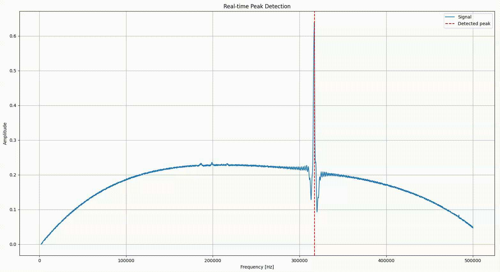

# AFM Resonance Peak Detector – AutoTune Algorithm

## Automatická detekce rezonančních špiček pro self-sensing sondy (Akyiama, NenoProbes)

Tento repozitář obsahuje referenční implementaci algoritmu pro detekci rezonančních špiček z frekvenčních sweepů self-sensing sond používaných v AFM (Atomic Force Microscopy). Jedná se o součást projektu **TACOM – TM03000033** (https://starfos.tacr.cz/cs/projekty/TM03000033), jehož cílem je zvýšení automatizace a spolehlivosti měření na AFM zařízeních, konkrétně systému **LiteScope** od společnosti NenoVision.

### 📂 Obsah repozitáře

- `peak_detector/peak_detector.py` – hlavní algoritmy pro odstranění trendu, výpočet vlnkových koeficientů a detekci špiček.
- `signal_generator/signal_generator.py` – nástroj pro generování simulovaných signálů odpovídajících výstupům z self-sensing sond.
- `example.py` – ukázkový skript s real-time vizualizací detekce špiček.
- `test_data/` – referenční data z reálných měření.

🖼️ Ukázka detekce (viz soubor `detection_demo.gif`):



---

### 🧠 Hlavní principy algoritmu

1. **Odstranění trendu** pomocí asymetrického kvadratického vyhlazování (ALS).
2. **Vlnková transformace (CWT)** pomocí vlnky typu *Mexican Hat*.
3. **Detekce lokálních maxim** ve vlnkových koeficientech.
4. **Sledování horizontálních linií** v matici maxim pro detekci kontinuálních špiček.
5. **Filtrace falešných špiček** dle výšky signálu a tvaru křivky.
6. **Určení hranic špičky** analýzou rozptylu gradientu signálu.

---

### 📊 Validace

- Validováno na **94 měřeních** s různými typy sond (Akyiama, NenoProbes) jak **na vzduchu**, tak **ve vakuu (SEM)**.
- Detekce byla úspěšná ve 100 % případů.
- Průměrná přesnost detekce byla **1,5 Hz**.
- Průměrná doba ladění: **40,5 sekundy**.

---

### 🧪 Požadavky na prostředí

- Python 3.9.19
- Požadované knihovny:
  ```bash
  pip install scipy==1.9.3 numpy==1.23.5 PyWavelets>=1.4.1
  ```

---

### 🛠️ Použití

```bash
python example.py
```

Spustí real-time simulaci s generovaným signálem a detekcí špiček.

---

### Projekt TACOM – TM03000033

Tento repozitář vznikl za účelem splnění výstupu projektu **TACOM – TM03000033** podporovaného TAČR. Cílem projektu je vyvinout pokročilé algoritmy pro zpracování signálů z AFM měření a zvýšit jejich robustnost, přesnost a automatizaci při reálných měřeních.

---

## Automatic Resonance Peak Detection for Self-Sensing AFM Probes (Akiyama, NenoProbes)

This repository contains a reference implementation of an algorithm for detecting resonance peaks from frequency sweep data of self-sensing AFM probes. It is part of the **TACOM – TM03000033** project (https://starfos.tacr.cz/cs/projekty/TM03000033), which focuses on improving automation and robustness in AFM measurements, specifically within the **LiteScope** system by NenoVision.

### 📂 Repository Structure

- `peak_detector/peak_detector.py` – core signal processing algorithms: baseline removal, wavelet transform, peak detection.
- `signal_generator/signal_generator.py` – tool to simulate signals mimicking real-world self-sensing probe outputs.
- `example.py` – real-time demo script showing peak detection in action.
- `test_data/` – contains reference datasets from actual measurements.

Example detection (see `detection_demo.gif`):


---

### 🧠 Core Algorithm Steps

1. **Baseline removal** using asymmetric least squares smoothing (ALS).
2. **Wavelet transform (CWT)** with a *Mexican Hat* wavelet.
3. **Detection of local maxima** in the coefficient matrix.
4. **Line tracing** through coefficient space to identify peak trajectories.
5. **Filtering of false peaks** based on amplitude and signal shape.
6. **Boundary estimation** using variance analysis on signal gradients.

---

### 📊 Validation

- Validated on **94 real-world measurements** with various probe types (Akiyama, NenoProbes) in **air** and **SEM vacuum** conditions.
- Detection was successful in 100% of cases.
- Mean error for detection was **1.5 Hz**.
- Tuning success rate improved from 78.9% to **100%** after introducing a final refinement step.
- Average tuning time: **40.5 seconds**.

---

### 🧪 Requirements

- Python 3.9.19
- Install dependencies:
  ```bash
  pip install scipy==1.9.3 numpy==1.23.5 PyWavelets>=1.4.1
  ```

---

### 🛠️ Usage

```bash
python example.py
```

Runs a real-time simulation of signal generation and peak detection.

---

### About the TACOM Project

This repository is part of the deliverables for **TACOM – TM03000033**, a project funded by the Technology Agency of the Czech Republic (TAČR). The goal is to develop advanced signal processing algorithms for AFM/SEM instruments to ensure fast, accurate, and automated measurements.

---
